# SUB POSTER BOT
This telegram bot allows subscribers to create their own posts on your channel; or sent posts to the special moderated
channel to confirm it. 
For now interface is only in russian.

# Features
- Supporting photo, animation and video post types.
- You can add multiple channels.
- You can add multiple administrators.
- Telegram native message text formatting.
- Like and dislike buttons at posts.
- You can set custom daily posts limit for each user and for any channel.
- Rating. +1 point for like and -1 point for dislike.
- Users statistic (rating, posts amount, likes, dislikes amount).

# How to config
1. Copy default_config.py file to config.py
2. Now all next changes will be in config.py.
3. Create bot and enter your token to *TOKEN* field. See [Telegram Bot Introduction](https://core.telegram.org/bots).
```python
TOKEN = "123456:ABC-DEF1234ghIkl-zyx57W2v1u123ew11"
```

4. Enter database parameters. By default, this bot use PostgresDB.
```python
DB_HOST = "127.0.0.1"
DB_PORT = 5432
DB_NAME = "your_bot_db_name"
DB_USER = "postgres"
DB_PASSWORD = "really_secure_password"
```

5. Optional. Enter your telegram id. You can get it after starting bot by command '/get_id' in the private conversation with bot.
Without this field you can't add channels, add new admins and use other admins only commands. 
By default, SUPER_ADMIN_ID will be saved id DB with username = 'superuser'.
```python
SUPER_ADMIN_ID = 112233445
```

6. Optional. You can set EXCEPTION_LOG_CHAT_ID, then bot will send exceptions text in this chat. It can be your private
conversation or special channel.

# How to run
1. Setup configuration and run database.
2. Installing requirements. Recommended to use [Python Virtual Environment](https://docs.python.org/3/tutorial/venv.html).
```python
pip install -r requirements.txt
```
3. Run bot.
```python
python start.py
```

# Setup Webhooks
1. By default, bot use polling. It's not recommended for production. You can set webhooks in config.py.
Telegram API require domain with SSL! Only 'https://' links.
   
```python
WEBHOOK_HOST = '127.0.0.1'
WEBHOOK_PORT = 5000
POLLING_USING = False  # disable polling to start aiohttp app.
```

2. Set Nginx redirection to 127.0.0.1:5000.
Nginx config example:
   
```python
server {
  listen 443 ssl;
  server_name example.com;


  location /your_bot_token {
     proxy_pass http://127.0.0.1:5000/bot/;
  }
}
```

3. Restart Nginx.
```commandline
sudo systemctl reload nginx
```

4. Go to the [BotFather](https://t.me/botfather) and set domain settings to your bot.
   See [Telegram Bot API](https://core.telegram.org/bots/api) -> Webhooks.

# Using examples
### Creating post
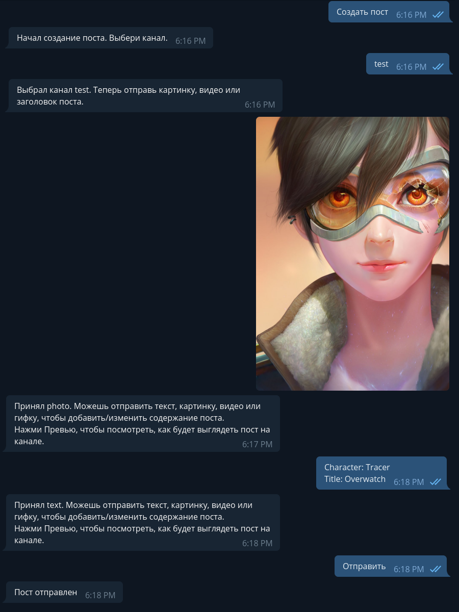

Post after sending to the channel.


### Text formatting
You can use formatting by right click on pc and long press on phone -> formatting.
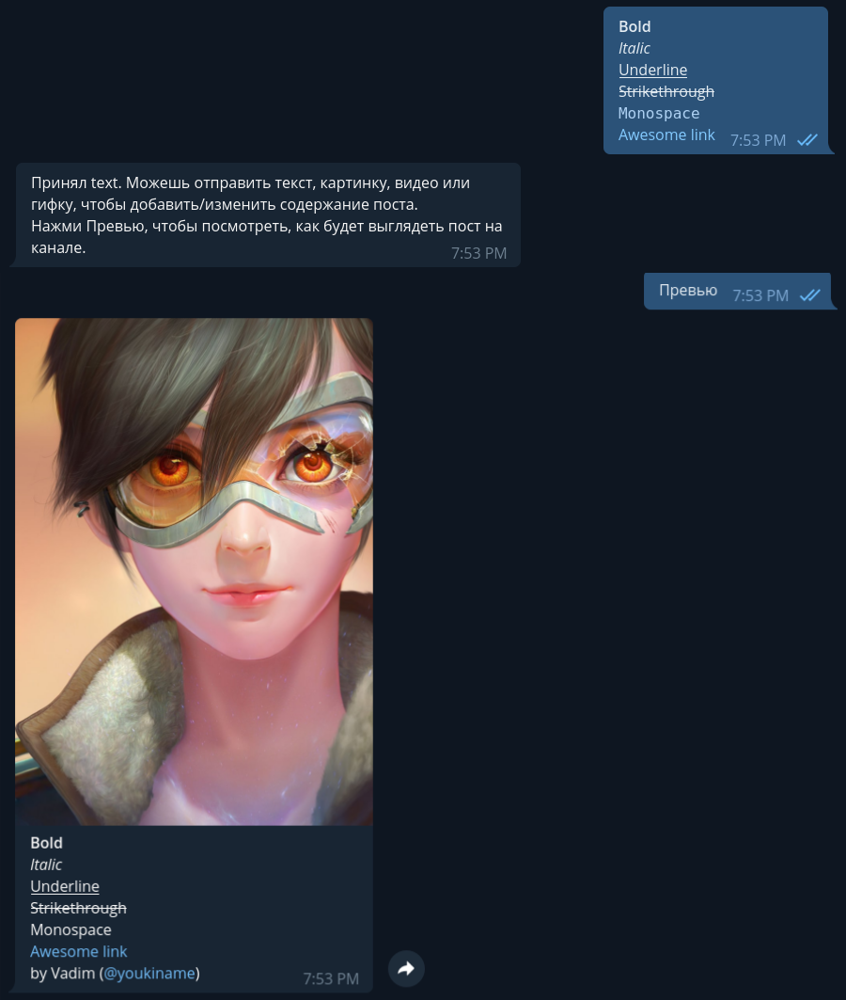

### Post sign
Bot can automatically add your first name or username to a post caption.
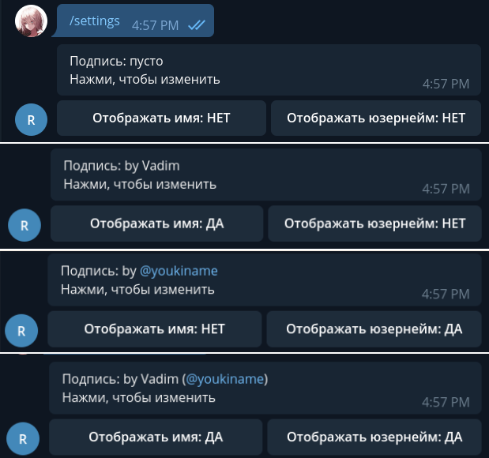

### Your profile info
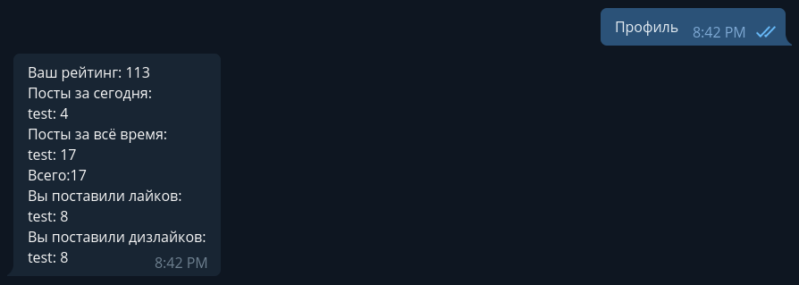

## Admin commands
### Add new admin.
Superuser required.
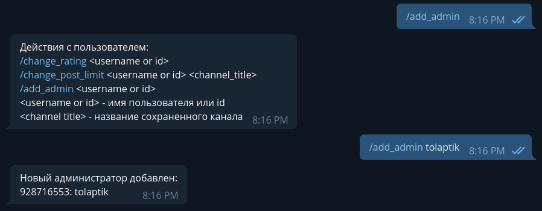

### Delete admin.
Superuser required.
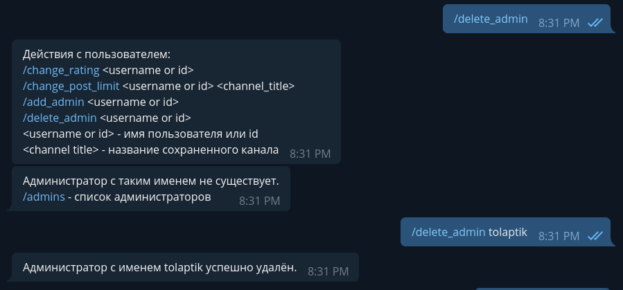

### Add new channel.
Superuser required.
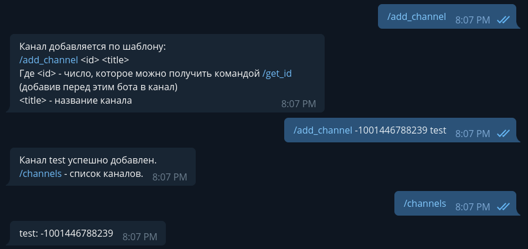

### Delete channel.
Superuser required.
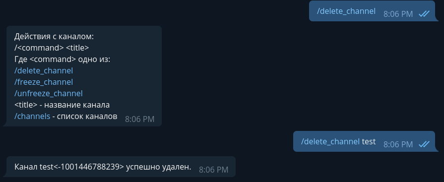

### Freeze channel.
Admin required. After freezing users can't send new posts to this channel until unfreeze.
Channel will not be displayed while post creating.
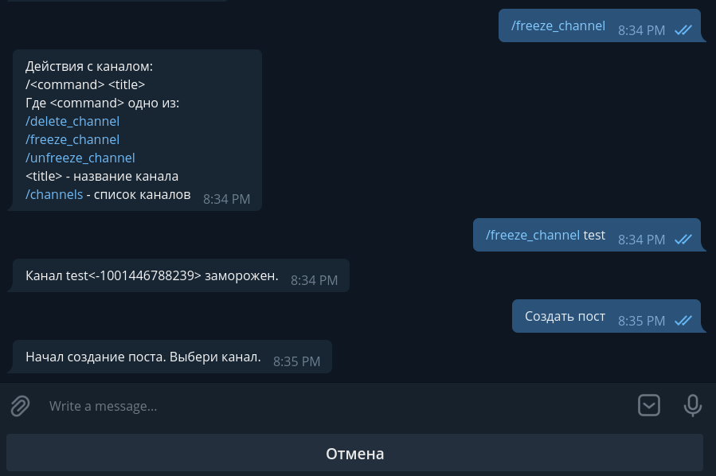

### Unfreeze channel.
Admin required.
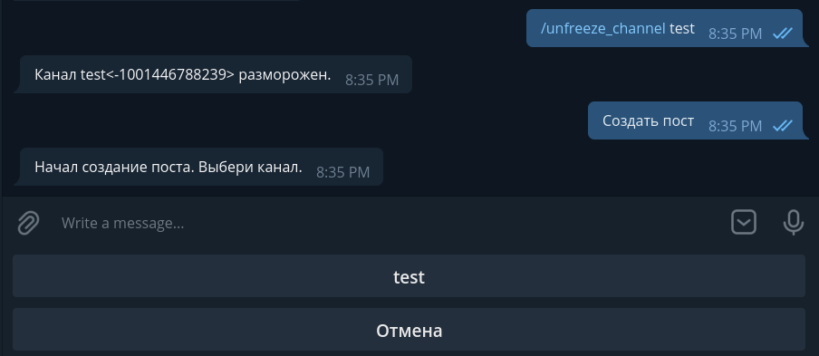

### Change user custom daily posts limit.
Admin required. User can send only 2 posts by default in every channel. You can set own limit for each user.
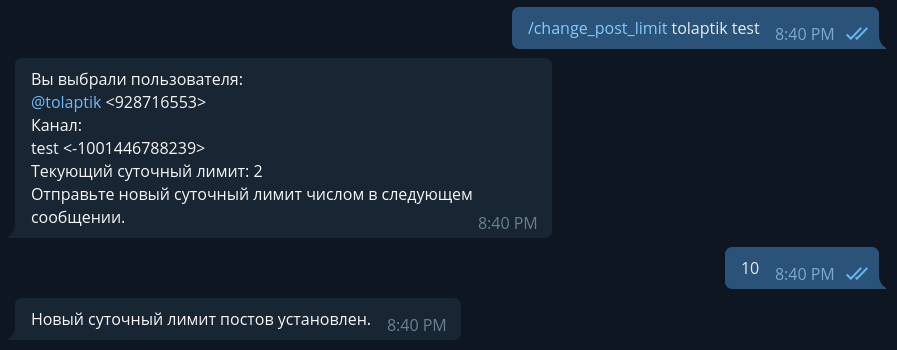

### Change user rating.
Admin required.
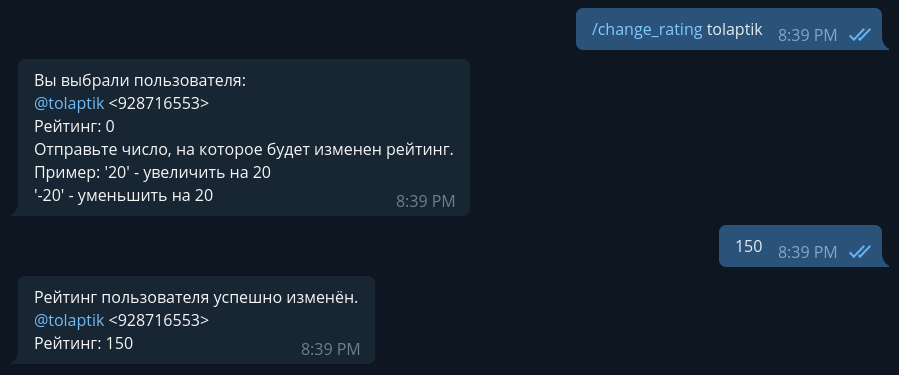


# TODO
- English translation
- Moderated channel
- Change default channel daily posts limit.
